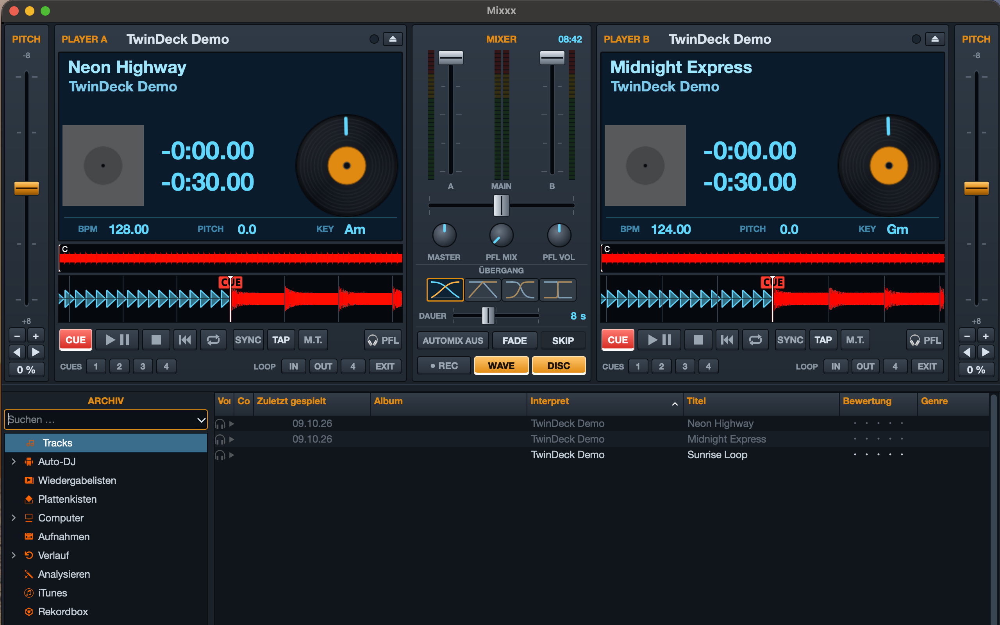

# TwinDeck Classic

A lean skin for [Mixxx](https://mixxx.org) 2.5 in the style of classic early-2000s two-deck DJ software:
two players, a mixer with automix in the middle and the library below. No effect rack, no samplers,
no four decks: just what you actually need to play a set.



## Features

**Player A / B**
- LCD display with cover art, title, album, genre, year, large time display, BPM, pitch and key
- The LCD turns red when the track is about to end
- Beat LED flashing in time with the music
- Track overview (click to jump) and scrolling waveform
- Spinning vinyl
- CUE, play/pause, stop, SYNC, TAP, master tempo (keylock), pre-listen (PFL), eject
- 4 hot cues (left-click sets or jumps, right-click clears)
- Loop IN / OUT / 4 beats / EXIT
- Pitch fader on the outer edge with fine adjustment (±), pitch bend (◀ ▶) and reset to 0 %

**Mixer**
- Channel faders with level meters, main output level left/right
- Crossfader
- Knobs for main volume, headphone mix and headphone volume
- **Transition presets:** four buttons for the crossfade shape (smooth, overlap, fast, cut).
  The icons show the actual volume curves of both decks and apply to both the crossfader and automix.
- **Automix** (Mixxx Auto DJ) with FADE and SKIP
- Recording (REC), clock, toggles for waveform and vinyl (WAVE, DISC)

**Library**
- Search, sidebar with library, playlists, crates, Auto DJ queue and file browser ("Computer")
- Drag & drop tracks straight from Finder or Explorer onto a player

## Installation

1. Download or clone this repository:
   ```
   git clone https://github.com/<user>/twindeck-classic-mixxx-skin.git
   ```
2. Copy the folder into the Mixxx skins directory and **rename it to `TwinDeck Classic`**:

   | System | Skins directory |
   |---|---|
   | Windows | `%LOCALAPPDATA%\Mixxx\skins\` |
   | macOS (download from mixxx.org) | `~/Library/Containers/org.mixxx.mixxx/Data/Library/Application Support/Mixxx/skins/` |
   | macOS (self-built / Homebrew) | `~/Library/Application Support/Mixxx/skins/` |
   | Linux | `~/.mixxx/skins/` |

   If the `skins` folder does not exist yet, simply create it.
3. Start Mixxx → **Preferences → Interface → Skin → TwinDeck Classic**.

## Quick guide

- **Automix:** add tracks to the queue via right-click → "Add to Auto DJ Queue (bottom)" (or drag them onto
  "Auto DJ" in the sidebar), then press **AUTOMIX**. With an empty queue, automix switches off immediately.
- **Fade duration and mode:** in the library under *Auto DJ*, above the queue (seconds field and mode selector).
- **End-of-track warning:** set the timing under *Preferences → Waveforms → End of track warning*.
- On startup the transition preset **Smooth** is always active.

## Optional: TwinDeck Classic Helper (vinyl brake & timed fade)

A Mixxx skin cannot trigger effects like the vinyl brake on its own; Mixxx only offers them to
controller scripts. The optional **TwinDeck Classic Helper** is such a script. It runs on a
*virtual* MIDI port, so no hardware is needed. With the helper active:

- **▶ ❚❚** brakes the track like a turntable being switched off (it stays at that position) and
  spins it up softly when you press play again
- **■** brakes the track as well; pressing it while stopped jumps back to the start
- **FADE** cross-fades to the other player within the time set by the new **DAUER** (duration) slider
  (0–20 s), using the selected transition shape. While automix is running, Auto DJ handles the fade.

Without the helper, the skin works exactly as before. Its extra controls are only shown while the
helper is running.

### Setup

1. **Create a virtual MIDI port**
   - **macOS:** open *Audio MIDI Setup* → *Window → Show MIDI Studio* → double-click *IAC Driver* →
     tick *Device is online* → *Apply*.
   - **Windows:** install the free [loopMIDI](https://www.tobias-erichsen.de/software/loopmidi.html)
     and create a port.
   - **Linux:** the *Midi Through* port is usually available already.
2. **Copy the helper** from the `controllers` folder of this repository
   (`TwinDeck-Classic-Helper.midi.xml` and `TwinDeck-Classic-Helper.js`) into the Mixxx
   controllers folder:

   | System | Controllers folder |
   |---|---|
   | Windows | `%LOCALAPPDATA%\Mixxx\controllers\` |
   | macOS (download from mixxx.org) | `~/Library/Containers/org.mixxx.mixxx/Data/Library/Application Support/Mixxx/controllers/` |
   | macOS (self-built / Homebrew) | `~/Library/Application Support/Mixxx/controllers/` |
   | Linux | `~/.mixxx/controllers/` |

   Create the folder if it does not exist.
3. **Enable it in Mixxx:** *Preferences → Controllers →* your virtual port (e.g. *IAC Driver Bus 1*)
   → select the mapping **TwinDeck Classic Helper** → tick *Enabled* → *OK*.

The **DAUER** slider below the transition buttons appears as soon as the helper is running.

## Requirements

- Mixxx 2.5 (developed and tested with 2.5.6 on macOS)
- Windows and Linux should work but have not been tested yet. Feedback is welcome.

Button labels and tooltips of the skin are currently in German. Mixxx's own menus and library
follow your Mixxx language setting.

## License

GPL-2.0-or-later, in line with Mixxx. See [LICENSE](LICENSE).
